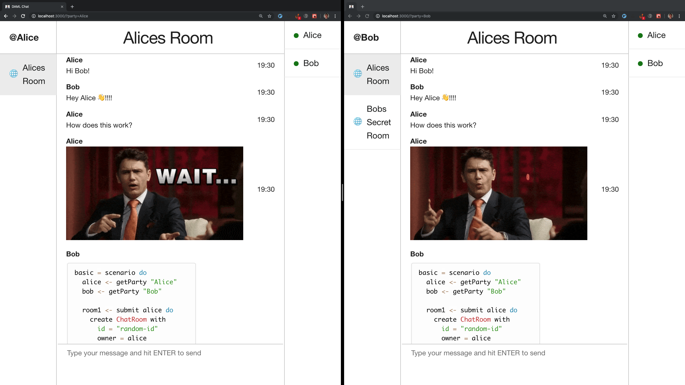

# DAML Chat App



## Credits

UI shamelessly stolen from [React Direct Messaging Example by Pusher](https://pusher.com/tutorials/react-direct-messaging).

## Setup

Requirements:
  - `node` (`brew install node`)
  - [`daml sdk`](https://docs.daml.com/getting-started/installation.html)

## Running

First run `npm install` to install required dependencies.

`npm start` will:
  - Build the DAML project
  - Start the sandbox using the DAML project
  - Start the json-api pointed at sandbox
  - Start the React app using the live reloading dev server and open a browser

## Running on Canton

First, run `npm install` to install the dependencies.

Then, run `npm run build` to build the dar.

Then, start `bin/canton -v -c examples/03-split-configuration/participant1.conf` from the `daml-chat-app` directory.

Now, connect to the global domain `connect(participant1, "global", "https://canton.global", autoConnect=true)` and add yourself
`enable_party(participant1, "YOURNAME")`.

Once you are connected, run the `setup.sc` script from canton by typing `import $file.setup`.
The import command only works with file endings `.sc`. The setup script will export the parties
into `live-stubs/parties.json`.

Now, start the chat app `npm run live`

A browser window will open now. Adjust the query arguments to `http://localhost:3000?ledgerId=participant1`.

## Chat Usage

**Commands:**
  - `/create my new room`: Creates a new chat room
  - `/invite Bob`: Invite a party to join the chat room
  - `/giphy Of course this works`: because why not?

**Features:**
 - DAML syntax highlighting of code blocks with ` ```daml`

## Building

  - `npm run clean` will remove built artifacts from `build` and `.daml`.
  - `npm run build` will build a DAR for the daml project and the static resources for the React application, then add the web content to a `ui` directory in the built DAR.
